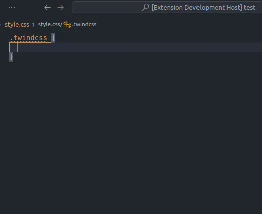
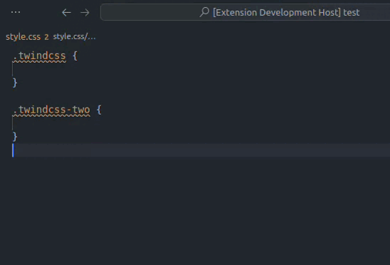

    

    
    

   

    <h1 style="font-size: 60px">Tailwind to CSS</h1>
    

**[Install via the Visual Studio Code Marketplace →](https://marketplace.visualstudio.com/items?itemName=bradlc.vscode-tailwindcss)**

## Features 

- Converts inline Tailwind CSS classes to CSS properties.
- Conversion of multiple Tailwind CSS classes to CSS blocks.
- Snippets to complete Tailwind classes.

#### Convert cursor position line

 

    

#### Convert multiple lines

 

    

## Installation

**[Install via the Visual Studio Code Marketplace →](https://marketplace.visualstudio.com/items?itemName=bradlc.vscode-tailwindcss)**
